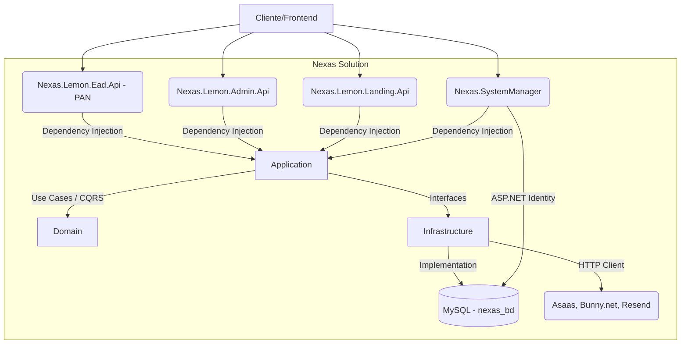

# Nexas Backend

## Descrição
O backend da plataforma **Nexas** é uma solução distribuída em múltiplos pontos de entrada (APIs) voltada para o gerenciamento e exibição de cursos, aulas, finanças (checkout), suporte e landing pages. A aplicação interage com serviços externos como Asaas (Gateway de Pagamento), Bunny.net (Hospedagem de Vídeos e Arquivos) e Resend (E-mails).

---

## Tecnologias
* **Linguagem / Framework:** C# 12, .NET 8.0
* **Banco de Dados:** MySQL 8.0.36
* **ORM:** Entity Framework Core (Pomelo.EntityFrameworkCore.MySql)
* **Arquitetura / Padrões:** Clean Architecture, DDD, CQRS (MediatR), Repository Pattern
* **Validação:** FluentValidation
* **Autenticação:** JWT (JSON Web Tokens) nas APIs de domínio; ASP.NET Core Identity no `Nexas.SystemManager`
* **Real-time:** SignalR
* **Integrações Externas:** Asaas API, Bunny.net API, Resend Email API, Cloudflare Storage

---

## Arquitetura

O projeto adota os princípios da **Clean Architecture** e **DDD**, com separação lógica clara através de múltiplos projetos na Solution. O fluxo de dados segue o padrão CQRS, separando leituras (Queries) de escritas (Commands).



### Estrutura do Projeto

A solução (`Nexas.sln`) está dividida nos seguintes projetos:

- **`Nexas.Domain`**: O núcleo da aplicação. Contém as Entidades (User, Course, Module, Lesson, Purchase, Ticket, etc.), Value Objects e Enums. **Não possui dependências externas.**
- **`Nexas.Application`**: Contém as regras de negócio organizadas por *Vertical Slicing* (Feature Folders). É aqui que o MediatR processa `Commands` e `Queries`. Contém as validações (FluentValidation) e as interfaces para a infraestrutura.
- **`Nexas.Infrastructure`**: Implementa as interfaces definidas na Application. Responsável por acesso a dados (`NexasDbContext`, EF Core Migrations) e comunicação com APIs externas (AsaasService, BunnyVideoService).
- **`Nexas.Lemon.Ead.Api`**: **Portal do Aluno Nexas (PAN)**. API destinada ao aluno logado — cursos, aulas, financeiro, fórum, tickets de suporte e o hub de pagamentos (SignalR). Renomeada de `Nexas.Api`.
- **`Nexas.Lemon.Admin.Api`**: API administrativa. Destinada a Professores e Administradores para criação e gestão de cursos, aprovação de reembolsos e relatórios financeiros. Renomeada de `Nexas.Admin.Api`.
- **`Nexas.Lemon.Landing.Api`**: API minimalista e pública para servir dados à Landing Page (sem autenticação). Renomeada de `Nexas.Landing.Api`.
- **`Nexas.SystemManager`**: Projeto novo, ainda em consolidação. Gerencia o cadastro de "Applications" (apps/sistemas cadastrados na plataforma) e usa **ASP.NET Core Identity** isolado (`SystemManagerDbContext`) para emissão de login/registro via `AddIdentityApiEndpoints`. Roda migrations e um seeder de Roles automaticamente no startup. Registra `ICurrentUserService`, `IPaymentEventPublisher` e o `PaymentHub` (SignalR) em `Services/`/`Hubs/` — necessários porque `AddApplication()` carrega **todos** os handlers do MediatR do `Nexas.Application`, mesmo os que este projeto não expõe via controller.

> Todas as APIs de domínio (`Ead`, `Admin`, `Landing`) compartilham o mesmo `NexasDbContext`/`nexas_bd`. O `SystemManager` também aponta para `nexas_bd`, mas mantém seu próprio `DbContext` (`SystemManagerDbContext`) para as tabelas de Identity.

---

## Fluxo da Aplicação (Exemplo CQRS)

1. **Request:** O cliente chama um Endpoint no Controller (ex: `CoursesController`).
2. **Controller:** O Controller mapeia a requisição para um `Command` ou `Query` e envia via `Mediator.Send()`.
3. **Validation (Pipeline):** O `ValidationBehavior` intercepta o request, roda o `FluentValidation` e bloqueia em caso de dados inválidos (retornando HTTP 400 global).
4. **Handler:** Se válido, o Handler correspondente (ex: `UpdateCourseCommandHandler`) é executado na camada Application.
5. **Domain/Infra:** O Handler recupera as entidades do banco através do `INexasDbContext`, aplica as regras, e salva via `SaveChangesAsync()`.
6. **Response:** O resultado é retornado de volta ao Controller.

---

## Autenticação e Autorização

- **Autenticação:** `Nexas.Lemon.Ead.Api` e `Nexas.Lemon.Admin.Api` usam `JwtBearer`, validado a cada requisição restrita via `Issuer`/`SigningKey`. `Nexas.SystemManager` usa `AddIdentityApiEndpoints` (ASP.NET Core Identity) em vez de JWT próprio.
- **Autorização (RBAC):** Baseado em Roles. A API Administrativa (`Nexas.Lemon.Admin.Api`) faz extenso uso de decoradores como `[Authorize(Roles = "Admin")]` e `[Authorize(Roles = "Teacher")]` no nível de classe e método.

| API | Autenticação | Security Headers | Global Exception Handler |
|---|---|---|---|
| `Nexas.Lemon.Ead.Api` (PAN) | JWT ativo | Ativo | Ativo |
| `Nexas.Lemon.Admin.Api` | JWT ativo | Ativo | Ativo |
| `Nexas.Lemon.Landing.Api` | **Desativado** (`AddAuthenticationSetup`, `UseAuthentication`/`UseAuthorization` comentados — API pública por design) | Ativo | Ativo |
| `Nexas.SystemManager` | ASP.NET Core Identity **+** `JwtBearer` (herdado do `AddApplication()`, ver aviso abaixo) | **Comentado** (`UseSecurityHeaders`) | **Comentado** (`UseGlobalExceptionHandler`) |

> [!WARNING]
> **Vulnerabilidade Identificada (BOLA/IDOR):** Apesar de verificar a Role (ex: *Teacher*), as ações de escrita (como `UpdateCourseCommand` e `DeleteLessonCommand`) não validam se o *Teacher logado* é de fato o dono daquele curso específico. Isso permite que qualquer professor modifique/exclua aulas de outros professores.

> [!WARNING]
> **`ApplicationsController` sem autorização (`Nexas.SystemManager`):** O atributo `[Authorize]` está comentado (`// [Authorize] // Remova o comentário quando a autenticação estiver pronta`), deixando todo o CRUD de `Applications` (Create/Read/Update/Patch/Delete) aberto a qualquer chamada não autenticada.

> [!WARNING]
> **`Nexas.SystemManager` sem `Jwt` no `appsettings.json`:** diferente das outras três APIs, o `appsettings.json` do `SystemManager` não tem seção `Jwt`. Como `AddApplication()` traz consigo o pipeline do MediatR inteiro (não só o que o `SystemManager` usa), o projeto acaba precisando do mesmo `AddAuthenticationSetup`/`JwtBearer` das demais APIs — e sem `Jwt:Key`, **toda requisição quebra com HTTP 500** (`IDX10703: key length is zero`), pois `app.UseAuthentication()` roda para qualquer rota, autenticada ou não. Localmente isso foi contornado adicionando uma chave de desenvolvimento em `appsettings.Development.json`; em produção essa seção precisa ser adicionada (via variável de ambiente) antes do deploy.

---

## Banco de Dados

- **Tecnologia:** MySQL (via Pomelo Entity Framework Core).
- **Abordagem:** Code-First com Migrations mantidas no projeto `Nexas.Infrastructure` (domínio) e no `Nexas.SystemManager` (Identity).
- **Comportamento (Tracking):** O proxy de Lazy Loading *não* está habilitado (boa prática). O carregamento de entidades relacionadas é feito via `Include` explícito.
- **Auto-Migration no Startup:**
  - `Nexas.Lemon.Admin.Api`: roda `context.Database.Migrate()` (domínio) automaticamente.
  - `Nexas.SystemManager`: roda `Database.Migrate()` para **domínio e Identity**, além de popular Roles via `DataSeeder.SeedRolesAsync`.
  - `Nexas.Lemon.Ead.Api` e `Nexas.Lemon.Landing.Api`: não chamam `Migrate()` no startup.

> [!TIP]
> **Migração de Identity travada no meio (MySQL não tem DDL transacional):** se uma migration do `SystemManagerDbContext` falhar no meio (ex: falta de configuração, ver aviso de `Jwt` acima), as tabelas já criadas por aquela migration (ex: `AspNetRoles`) permanecem no banco mesmo com a migration "falha" — porque o MySQL faz commit de cada `CREATE TABLE` individualmente, sem rollback. Na próxima tentativa, o `Migrate()` tenta recriar essas tabelas do zero e quebra com `Table 'x' already exists`, mesmo a `__EFMigrationsHistory` nunca tendo registrado a migration como aplicada. Solução: apagar manualmente as tabelas órfãs (`DROP TABLE`) e rodar de novo.

---

## Variáveis de Ambiente e Configurações

O projeto depende dos arquivos `appsettings.json` para rodar. No ambiente de Produção, todas as chaves sensíveis devem ser injetadas via Variáveis de Ambiente do Sistema Operacional ou Docker.

### Exemplo Seguro (O que o arquivo deve conter)
```json
{
  "ConnectionStrings": {
    "DefaultConnection": "Server=...;Port=...;Database=nexas_bd;Uid=...;Pwd=${DB_PASSWORD};"
  },
  "Jwt": {
    "Key": "${JWT_SECRET_KEY}",
    "Issuer": "apiNexas",
    "Audience": "apiNexasUsers"
  },
  "Asaas": {
    "BaseUrl": "https://api.asaas.com/v3/",
    "ApiKey": "${ASAAS_API_KEY}"
  }
}
```

> [!CAUTION]
> **Estado Atual:** Os `appsettings.json` de `Ead.Api`, `Admin.Api` e `Landing.Api` já foram trocados para placeholders (`INSERT_PASSWORD_HERE`, `INSERT_JWT_SECRET_KEY_HERE_MUST_BE_AT_LEAST_32_CHARS`) em vez de segredos reais — precisam ser sobrescritos via variável de ambiente (Docker `.env` / OS) para funcionar. O `SystemManager` é uma exceção: seu `appsettings.json` não tem seção `Jwt` nenhuma (nem placeholder) — ver aviso na seção de Autenticação acima. Nenhuma das quatro APIs deve rodar em produção sem essas variáveis de ambiente configuradas.

---

## Tratamento de Erros e Logs

- **Global Exception Handler:** `Nexas.Lemon.Ead.Api`, `Nexas.Lemon.Admin.Api` e `Nexas.Lemon.Landing.Api` implementam um `GlobalExceptionMiddleware` elegante (`Nexas.SystemManager` ainda não tem essa chamada ativa — ver tabela de Autenticação acima).
- Ele captura exceções não tratadas e formata a saída em um JSON padronizado.
- **Prevenção de Vazamento (CWE-209):** O Middleware verifica `env.IsDevelopment()`. Em produção, ele não vaza *Stack Traces* ou SQLs quebrados. Em caso de falha de validação, mapeia corretamente para o status `400 BadRequest`.
- **Logs:** Registros de erros são feitos de forma estruturada via `ILogger`.

---

## Portas

| Serviço | Porta local (`dotnet run` / launchSettings) | Porta externa (Docker Compose) |
|---|---|---|
| MySQL (`mysql_banco`) | 3306 (interna) | 3317 |
| `Nexas.Lemon.Admin.Api` | 5001 | 6012 |
| `Nexas.Lemon.Ead.Api` (PAN) | 5079 | 6011 |
| `Nexas.Lemon.Landing.Api` | 5002 | 6013 |
| `Nexas.SystemManager` | 5179 | 6014 |

## Executando Localmente via Docker Compose

1. Na raiz do repositório, garanta que você não tenha serviços ocupando as portas 3317 (Banco) e 6011/6012/6013/6014 (APIs).
2. Configure um arquivo `.env` seguro.
3. Suba o ambiente com:
```bash
docker-compose up -d --build
```
Isso levantará o banco MySQL e as quatro APIs simultaneamente.

---

## Problemas Conhecidos e Roadmap de Melhorias

Com base na auditoria arquitetural, abaixo está o plano de ação sugerido:

### 🔴 Prioridade 1 (Crítico) - Imediato
1. **Vazamento de Segredos:** Substituir os placeholders (`INSERT_PASSWORD_HERE`, `INSERT_JWT_SECRET_KEY_HERE...`) dos `appsettings.json` das quatro APIs por variáveis de ambiente reais antes de qualquer deploy — hoje eles não têm valor funcional nenhum, nem real nem de exemplo válido.
2. **`Nexas.SystemManager` sem seção `Jwt`:** ao contrário das outras três APIs, o `appsettings.json` do `SystemManager` não tem `Jwt:Key`/`Issuer`/`Audience` nenhum. Isso derruba **toda** requisição com HTTP 500 assim que o projeto rodar fora do `Development` (onde hoje só funciona por causa de um override manual em `appsettings.Development.json`, não commitado para produção).
3. **Broken Object Level Authorization (BOLA/IDOR):** Corrigir os Handlers administrativos (ex: `DeleteLessonCommandHandler`, `UpdateCourseCommandHandler`) para validar se o usuário autenticado é dono/criador do recurso antes de realizar atualizações ou exclusões.
4. **Exposição de Dados Internos:** O método `CoursesController.GetAll()` na `Admin.Api` está com `[AllowAnonymous]` e envia cursos inativos (`IncludeInactive: true`) de forma pública.
5. **`ApplicationsController` aberto no `Nexas.SystemManager`:** Reativar `[Authorize]` (hoje comentado) antes de expor esse projeto fora do ambiente de desenvolvimento — atualmente qualquer requisição sem token pode criar, editar ou excluir "Applications".

### 🟠 Prioridade 2 (Alto) - Próximo Ciclo
1. **Remover Auto-Migration no Startup:** As chamadas de `context.Database.Migrate()` dentro do `Program.cs` da `Admin.Api` e do `SystemManager` podem causar travamentos severos e perda de dados (Race Condition) caso duas instâncias da API tentem iniciar ao mesmo tempo em um cenário de escalabilidade. As migrações devem fazer parte da esteira CI/CD.
2. **`Nexas.SystemManager` sem middlewares de segurança:** Reativar `UseSecurityHeaders()` e `UseGlobalExceptionHandler()`, hoje comentados no `Program.cs`, para alinhar esse projeto com o padrão das demais APIs.

### 🟡 Prioridade 3 (Médio) - Roadmap
1. **Isolamento de Cache:** Adicionar estratégias de Redis para endpoints públicos altamente consumidos, como a lista de cursos da `Landing.Api`.

### 🔵 Prioridade 4 (Baixo) - Manutenção
1. **Testes Automatizados:** Não foram detectados projetos de testes maduros (XUnit/NUnit) validando o Core do Domínio ou fluxos complexos como Checkouts Financeiros.
